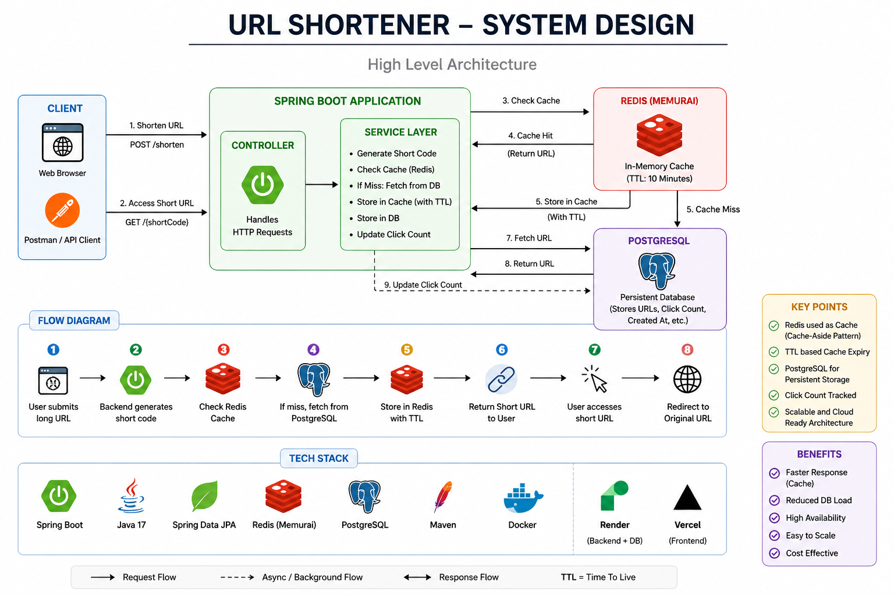
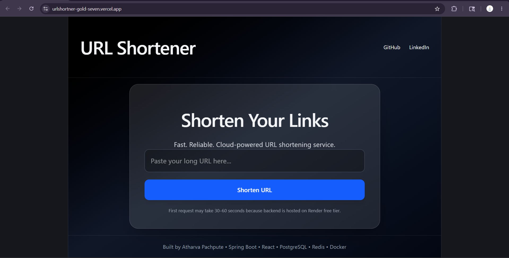
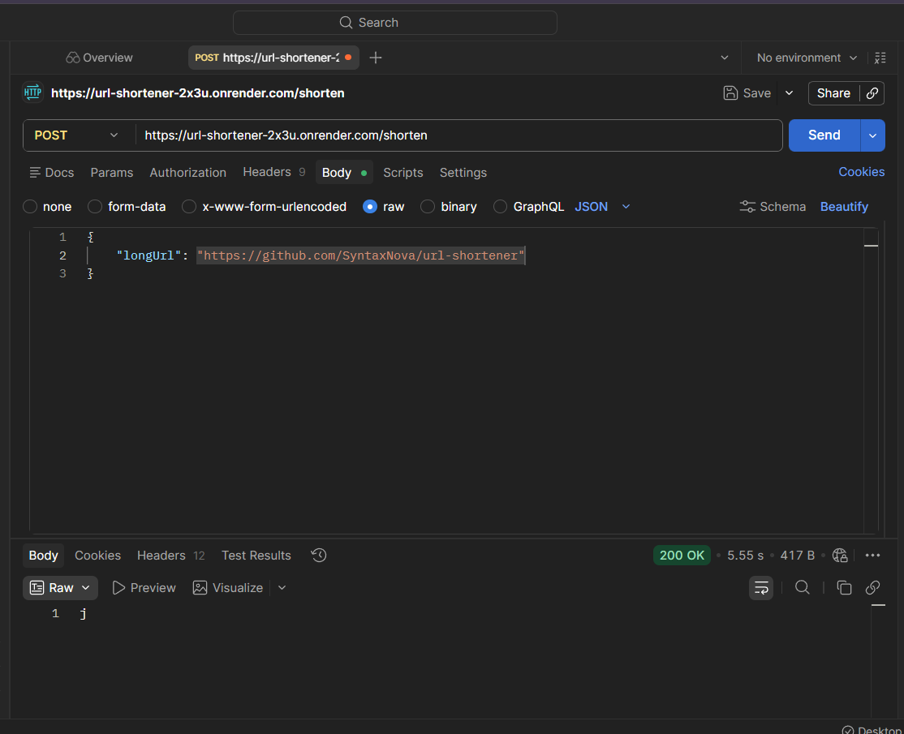
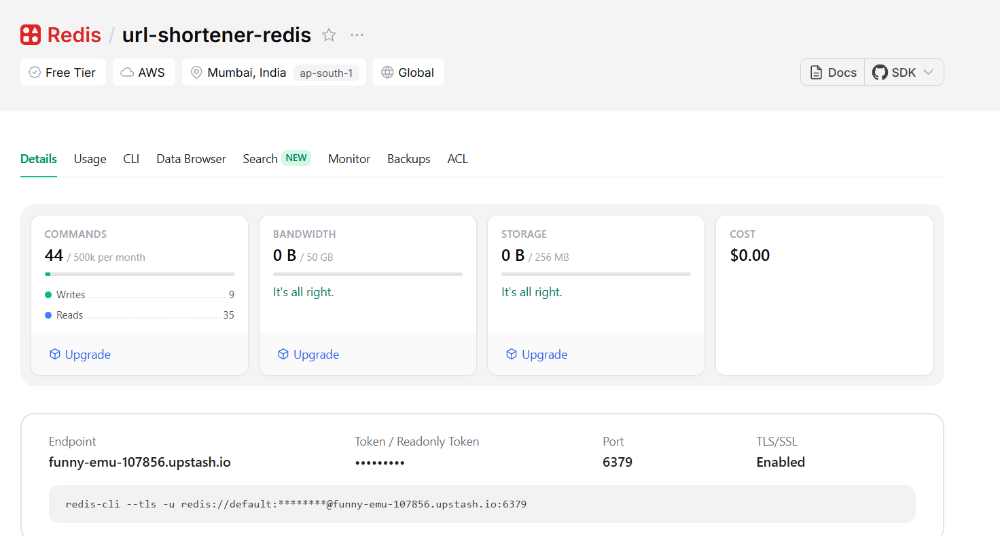
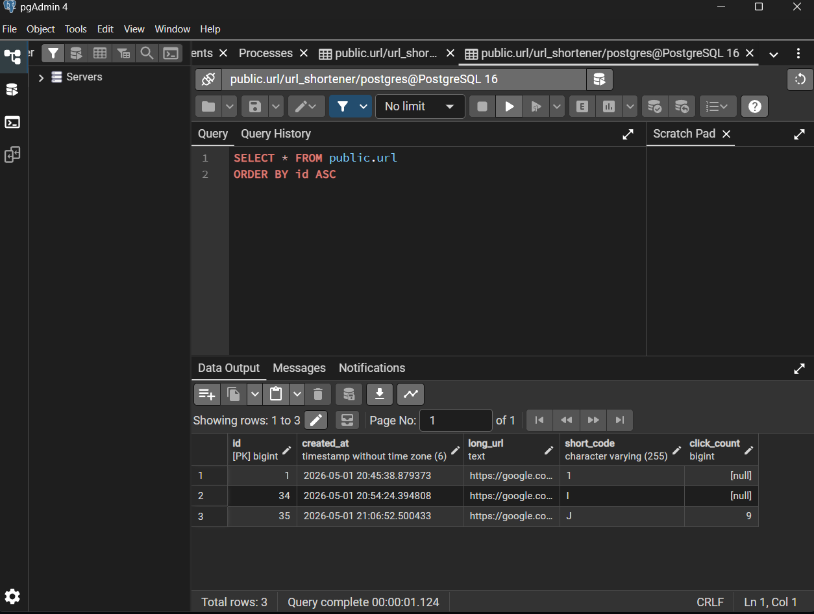
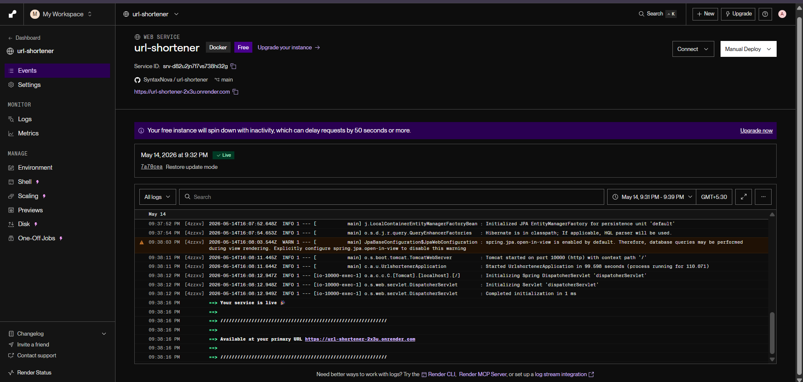

# 🚀 URL Shortener System

A scalable full-stack URL Shortener built using Spring Boot, PostgreSQL, Redis, React, and cloud deployment platforms like Render and Vercel.

---

# 🌐 Live Demo

## Frontend
https://urlshortner-gold-seven.vercel.app/

## Backend API
https://url-shortener-2x3u.onrender.com

---

# 📌 Features

- 🔗 Convert long URLs into short URLs
- ⚡ Fast redirection using Redis caching
- ⏳ TTL-based cache expiry
- 📊 Click tracking
- 🌐 Full-stack deployment
- ☁️ Cloud-hosted backend & frontend
- 🛢️ Persistent PostgreSQL storage
- 🚀 REST API architecture

---

# 🧠 System Architecture



---

# ⚙️ Tech Stack

| Technology | Usage |
|---|---|
| Java 17 | Backend Development |
| Spring Boot | REST API |
| PostgreSQL | Persistent Database |
| Redis | Caching Layer |
| React.js | Frontend |
| Vite | Frontend Build Tool |
| Maven | Dependency Management |
| Docker | Containerization |
| Render | Backend Deployment |
| Vercel | Frontend Deployment |

---

# 🔄 Application Flow

1. User submits long URL
2. Backend generates Base62 short code
3. URL stored in PostgreSQL
4. URL cached in Redis with TTL
5. User accesses short URL
6. System first checks Redis
7. If cache miss → fetch from PostgreSQL
8. Redirect user to original URL

---

# 📡 API Endpoints

## 🔹 Shorten URL

### Request

## Request Body

```json
{
  "longUrl": "https://google.com"
}
```

---

## Response

```json
a1B
```

---

# 🔹 Redirect URL

```http
GET /{shortCode}
```

### Example

```http
https://url-shortener-2x3u.onrender.com/a1B
```

---

# 📸 Screenshots

## 🔹 Frontend UI



---

## 🔹 Postman Testing



---

## 🔹 Redis Cache Verification



---

## 🔹 PostgreSQL Database



---

## 🔹Render Deployment



---

# 🧪 Local Setup

## Clone Repository

```bash
git clone https://github.com/SyntaxNova/url-shortener.git
```

---

# Backend Setup

```bash
cd url-shortener
```

## Configure PostgreSQL

Update:

```properties
application.properties
```

---

## Run Application

```bash
./mvnw spring-boot:run
```

---

# Frontend Setup

```bash
cd frontend
npm install
npm run dev
```

---

# ☁️ Deployment

| Service | Platform |
|---|---|
| Backend | Render |
| Frontend | Vercel |
| Database | Render PostgreSQL |
| Cache | Upstash Redis |

---

# 💡 Concepts Used

- Base62 Encoding
- REST APIs
- Cache-Aside Pattern
- Redis TTL
- Docker Deployment
- Full-Stack Deployment
- Cloud Hosting
- MVC Architecture

---

# 📌 Future Improvements

- Custom aliases
- QR code generation
- Link expiration
- Analytics dashboard
- Rate limiting
- JWT authentication
- User accounts

---

# 👨‍💻 Author

## Atharva Pachpute

🎓 BE Information Technology (SPPU)  
💻 Full Stack Developer  
📍 Pune, India

---

# Connect With Me

- GitHub: https://github.com/SyntaxNova
- LinkedIn: https://www.linkedin.com/in/atharva-pachpute3/
- Email: atharvacodes@gmail.com

---

# ⭐ If you liked this project

Give it a star on GitHub ⭐
