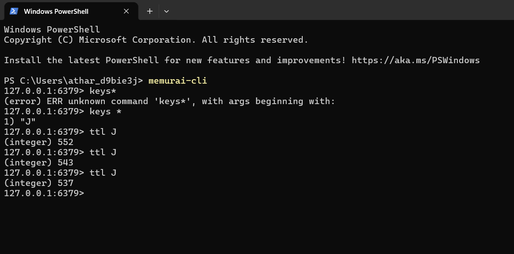

# 🔗 URL Shortener (Spring Boot + Redis)

## 🚀 Overview

A scalable URL shortener built using Spring Boot that converts long URLs into compact short links using Base62 encoding.
It uses Redis caching with TTL to improve performance and reduce database load.

---

## 🧠 Architecture

Client → Controller → Service → Redis → PostgreSQL

* Redis used as cache (cache-aside pattern)
* PostgreSQL used for persistent storage

---

## ⚡ Features

* 🔗 Shorten long URLs
* 🔄 Redirect to original URL
* ⚡ Redis caching for fast access
* ⏳ TTL (Time-To-Live) for cache expiry
* 📊 Click tracking (analytics)

---

## 🛠️ Tech Stack

* Java 17
* Spring Boot
* PostgreSQL
* Redis (Memurai)
* Maven

---

## 📡 API Endpoints

### 🔹 Shorten URL

POST /shorten

Body:
https://google.com

Response:
a1B

---

### 🔹 Redirect

GET /{shortCode}

Example:
http://localhost:8080/a1B

---

## 🧪 How to Run

1. Start PostgreSQL
2. Start Redis (Memurai)
3. Run Spring Boot app
4. Use Postman to test APIs

---

## 🔍 Redis Verification

memurai-cli
keys *
get 'shortCode'
ttl 'shortCode'

---

## 💡 Key Concepts Used

* Base62 Encoding
* Cache-Aside Pattern
* TTL-based Cache Expiry
* REST API Design

---

## 📸 Screenshots & Demo

### 🔹 Working 

### 🔹 Postgres

### 🔹 API Request (Postman) 

.png)

### 🔹 Redirect in Browser

### 🔹 Redis Cache & TTL Verification

## 📌 Future Improvements

* Custom alias support
* Link expiration
* Rate limiting
* Distributed ID generation

---

## 👨‍💻 Author

**Atharva Pachpute**

* 🎓 BE Information Technology (SPPU)
* 💻 Software Engineer
* 📍 Pune, India

### 🔗 Connect with me

* GitHub: https://github.com/SyntaxNova
* LinkedIn: https://www.linkedin.com/in/atharva-pachpute3/
* Email: [atharvacodes@gmail.com](mailto:atharvacodes@gmail.com)

---

